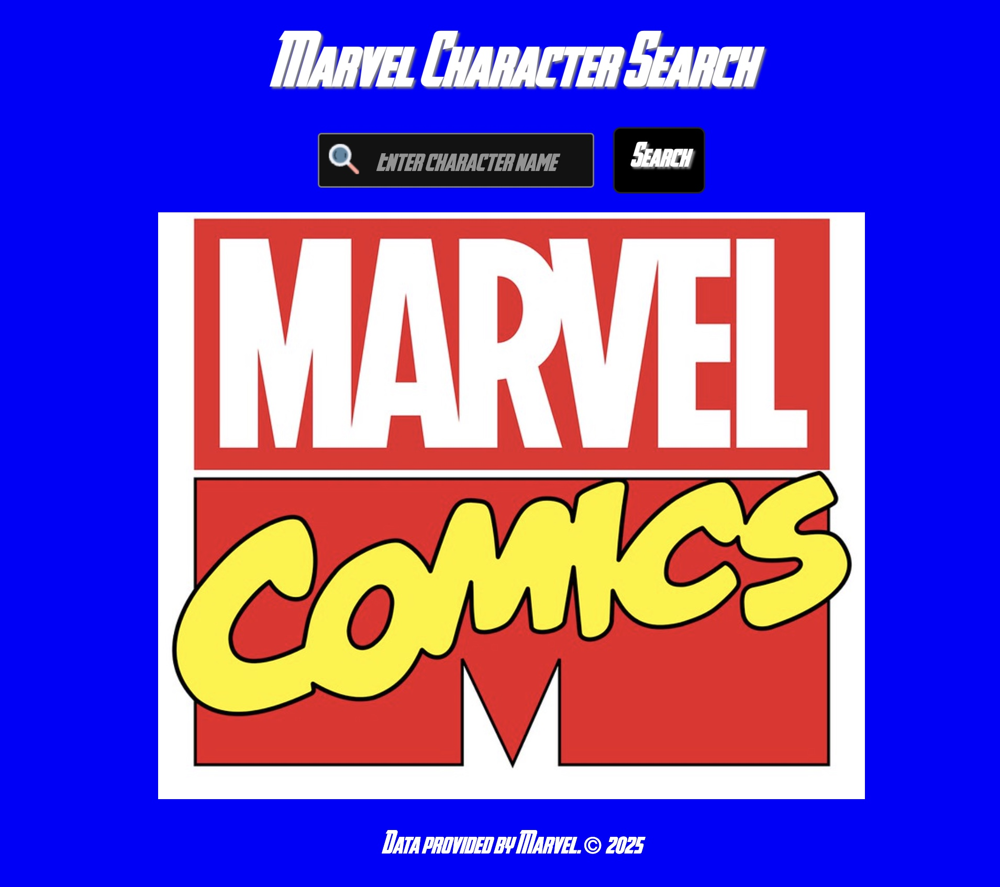

Marvel Character & Comic Query

DESCRIPTION:
Developed a dynamic web application that utilizes the Marvel API to enable users to search for Marvel characters and access detailed information, including character images and associated comics. Implemented client-side functionality using React, leveraging fetch for API integration and optimizing performance with features like lazy loading and debouncing. 

INSTRUCTIONS:

Use the search bar to type in the name of a Marvel character Wait until after search bar animation is done to press the search button When results load users see the name of the character, an image of the character, and a link to another page This second page shows a gallery of comics the searched character has been in Use the previous button to go back to the search page *Footer has Marvel copyright that leads back to their website.

Original JS version here: https://github.com/BlueSage96/MarvelAPIQueryOriginal

